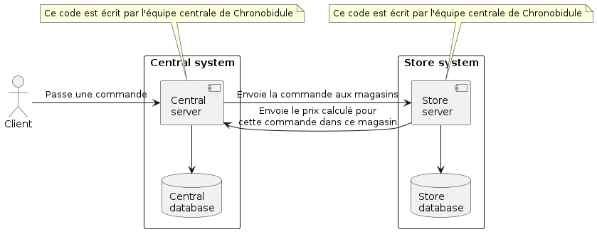
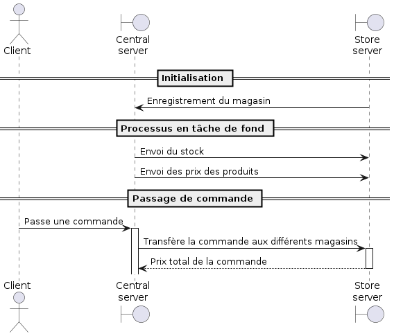

<h1 align="center">Welcome to Chronobidule 👋</h1>
<p>
  <a href="#" target="_blank">
    
  </a>
</p>

> A more complex version of the classical Extreme Carpaccio exercise over the wire. Price and stocks are sent by the central organism, and stores must return total pricing when given a list of products * quantities 

## Install

```sh
mvn install
```
Will generate both jars, but won't start the docker contained database.

## Usage

Start the central server
```sh
docker compose up
cd central && mvn spring-boot:run
```

Start a store
```sh
cd central && mvn spring-boot:run
```

## Architecture

### Deployment

Solution should be deployed the following way



### Sequence diagrams
Sequence of the calls should be




## Author

👤 **Alexandre Carbenay**

* Github: [@Alexandre-Carbenay](https://github.com/Alexandre-Carbenay)

## 🤝 Contributing

Contributions, issues and feature requests are welcome!<br />Feel free to check [issues page](https://github.com/Zenika/Enigma-2025-Chronobidule/issues). 

## Show your support

Give a ⭐️ if this project helped you!

***
_This README was generated with ❤️ by [readme-md-generator](https://github.com/kefranabg/readme-md-generator)_